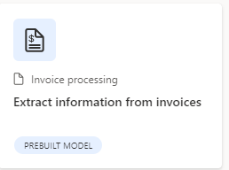
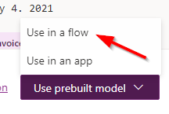
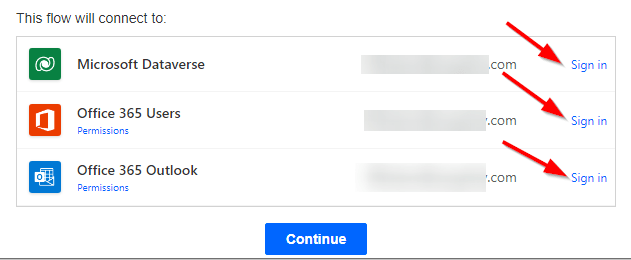
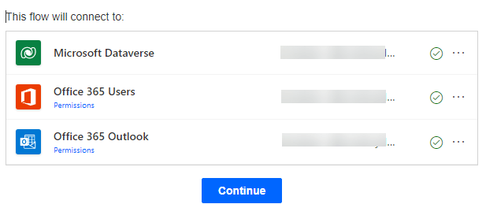
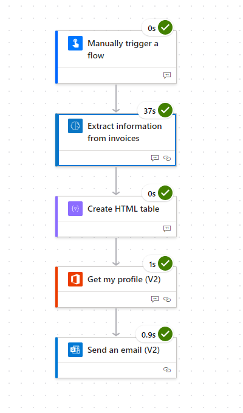
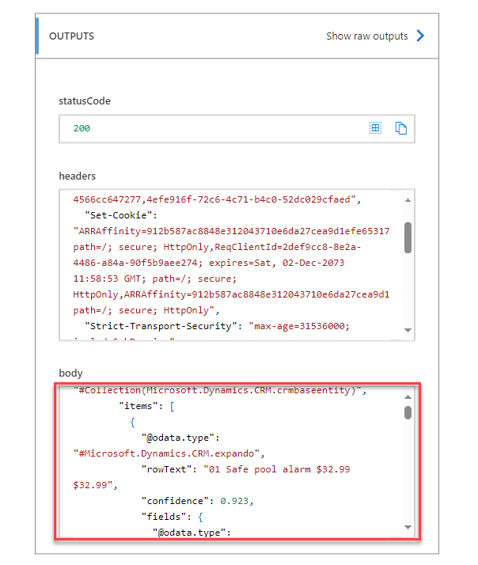
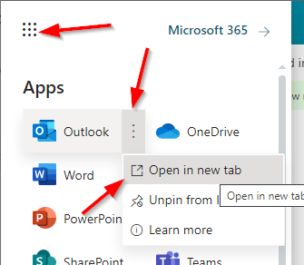
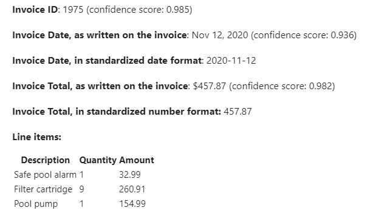

## Exercise 1: Working with Documnents

## Overview 

In this exercise, you will download sample data that will be used throughout the rest of the lab. From there, you will use a pre-created AI model to demonstrate how to programmatically parse an invoice in PDF Format. 

## Task 1: Download sample data

Each member of the team should complete this step.

Throughout the lab, you will need to upload various files to test out AI Builders capabilities.

- Create a folder somewhere on your computer named: **AIBuilderLabFiles**

- Download the [sample data file](https://opsgilitylabs.blob.core.windows.net/public/aibuilder/AIBuilderSampleData.zip) and unzip it's contents into the new folder.

## Task 2: Using an AI Model and Flow to Parse invoices

- Launch a new browser instance using in-private or in-cognito mode. 

- Start at the [Power Automate site](https://make.powerautomate.com/) and when prompted login with the Microsoft 365 lab account provided to your team.

- In the top right of the screen, change the Environment to **AIBuilderEnv** 

    

- With your environment selected choose **AI Models** from the navigation. If it is not visible you might have to click the **... More** navigation to add it to the menu. 

    

- In the main portion of the screen click on the **Documents** tab to filter the results. 

    
    
- Finally, select **Extract information from Invoices**

    

**Note:** Ensure that you are not in the **custom information** extraction

- In the dialog, click on **Use prebuilt model** and choose **Use in a flow** option from the dropdown. This means we will build a re-usable Power Automate Flow to create a re-usable Invoice Flow. 

    

- There are several connections required for this demonstration to work. If you have never used that connection before the screen will resemble the following:

    
    
- Click **Sign in** for each connection. When you click **Sign in** you will see a quick dialog and when you have **Signed in** to all three connectors it will resemble the following with **Green** circled checks:

    
    
- After that is complete you will need to click the **Continue** button

    
    
- This is using a pre-built model so there are no changes required to the **flow** presented

- Click on **Save** in the upper-right hand corner. Give it few seconds to complete. 

    \
    
- Then click on the **Test** button at the top right of your screen.

    
    
- You might also get another **Sign in** prompt. Click **Continue**

    
    

- Click the **Import** button.

- Open the **AIBuilderLabFiles** folder that has the downloaded sample data. Then open the **DocumentProcessing_Invoices_Adatum** folder and select the **Test** folder. There is only a single invoice in there and it is a pdf file called **Adatum 6.pdf** file. Select it for the import. 

- Then click the **Run flow** button at the bottom

    

- Flow is running. Then click **Done**

    

- Since there were no changes made the **final** step in the **Flow** sends an email but you should see the following steps with **green** checks next to each step:

    
    
- Click the step called **Extract information from invoices.** There are two sections available in the step. **Inputs** and **Outputs**. The **Input** section will show a binary section of text that represents the submitted pdf file. In the **Outputs** section you can see all the extracted fields in JSON format (used by developers).

    

- If you want to see the email click on the **9 square** in the upper right hand corner. Then choose **Outlook** but choose **Open in new tab**

    
    
- In **Outlook** open the item title **Invoice processed**

  
    
- Browse all the mapped fields in the email

    

    

