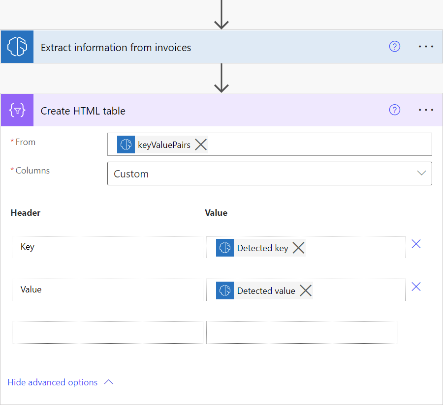
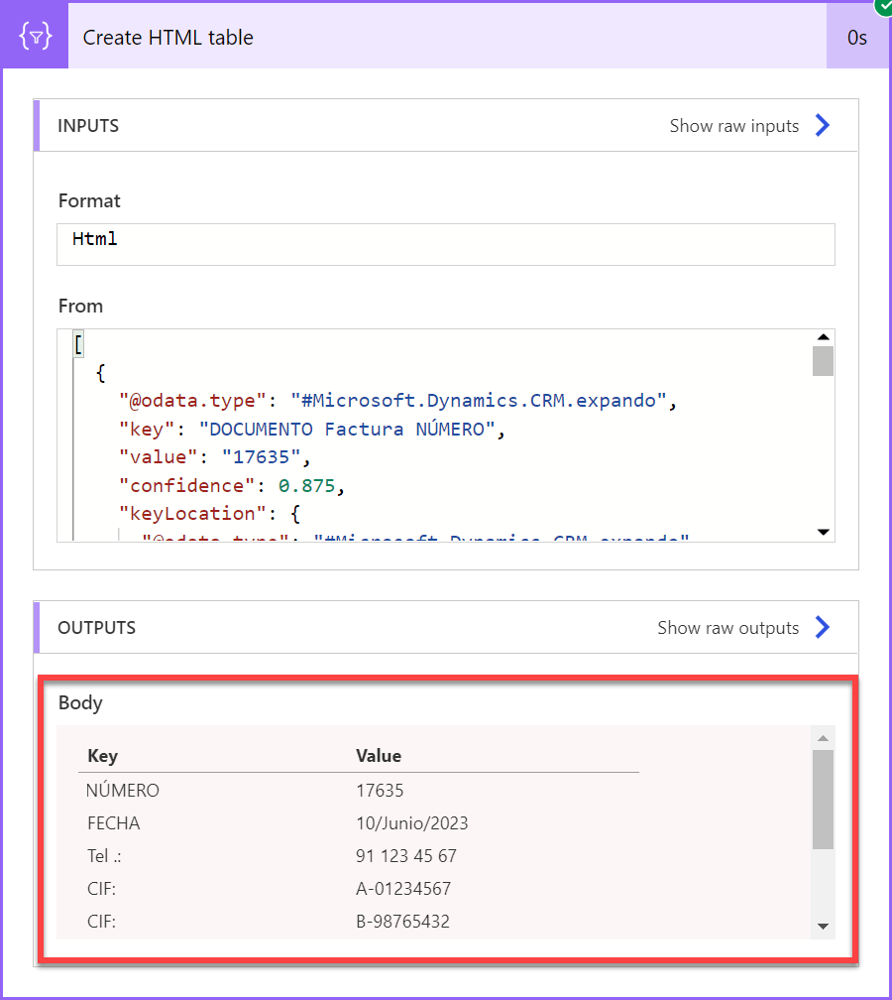
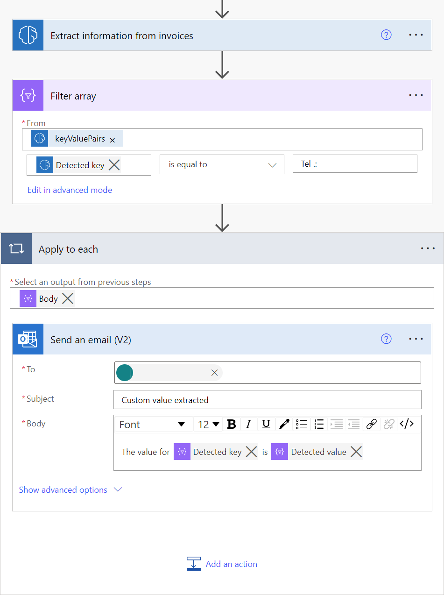
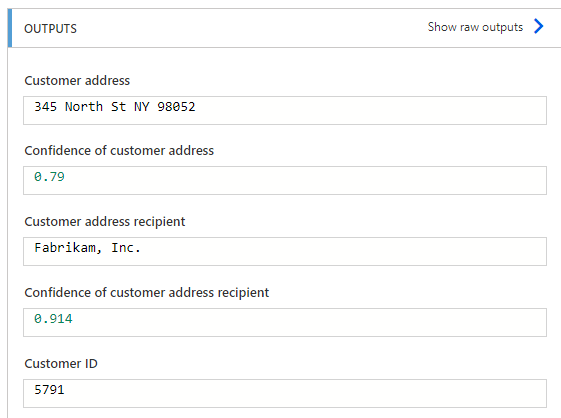

# Lab 1: Working with Documents

## Invoice processing prebuilt AI model

The invoice processing prebuilt AI model extracts key invoice data to help automate the processing of invoices. The invoice processing model is optimized to recognize common invoice elements like invoice ID, invoice date, amount due, and more.

## Supported languages and files

The following languages are supported: Dutch (Netherlands), English (Australia), English (Canada), English (India), English (United Kingdom), English (United States), French (France), German (Germany), Italian (Italy), Portuguese (Portugal), Spanish (Spain).

To get the best results, provide one clear photo or scan per invoice.

- The image format must be JPEG, PNG, or PDF.
- The file size must not exceed 20 MB.
- The image dimensions must be between 50 x 50 pixels and 10,000 x 10,000 pixels.
- PDF dimensions must be at most 17 x 17 inches, which is the equivalent of the Legal or A3 paper sizes or smaller.
- For PDF documents, only the first 2,000 pages are processed.

## Key-value pairs

Key-value pairs are all the identified labels or keys and their associated responses or values. You can use these to extract additional values that aren't part of the predefined list of fields.

To visualize all key-value pairs detected by the invoice processing model, you can add a **Create HTML table** action in your flow as shown in the screenshot and run the flow.

To extract a specific key for which you know its value, you can use the **Filter array** action as shown on the screenshot below. In the example of the screenshot, we want to extract the value for the key **Tel .:**

## Exercise 1
- Start at the [AI Builder site](https://powerapps.microsoft.com/ai-builder/)

- With your environment selected choose **AI Models** from the navigation. If it is not visible you might have to click the **... More** navigation to add it to the menu. 

    
    
- In the main portion of the screen click on the **Documents** tab to filter the results. Finally, select **Extract information from Invoices**

    
    
**Note:** Ensure that you are not in the **custom information** extraction

- In the dialog, click on **Use prebuilt model** and choose **Use in a flow** option from the dropdown. This means we will build a re-usable Power Automate Flow to create a re-usable Invoice Flow. 

    

- There are several connections required for this demonstration to work. If you have never used that connection before the screen will resemble the following:

    
    
- When you click **Sign in** you will see a quick dialog and when you have **Signed in** to all three connectors it will resemble the following with **Green** circled checks:

    
    
- After that is complete you will need to click the **Continue** button

    
    
- This is using a pre-built model so there are no changes required to the **flow** presented

- Click on **Save** in the upper-right hand corner. Give it few seconds to complete. 

    \
    
- Then click on the **Test** button

    
    
- You might also get another **Sign in** prompt. Click **Continue**

    
    
- Click the **Import** button and open the folder you extracted the **aibuilderlab** content into. Then open the **Lab Images** folder. Then open the **DocumentProcessing_Invoices_Adatum** folder and select the **Test** folder. There is only a single invoice in there and it is a pdf file called **Adatum 6.pdf** file. 

- Then click the **Run flow** button at the bottom

    

- Flow is running. Then click **Done**

    

- Since there were no changes made the **final** step in the **Flow** sends an email but you should see the following steps with **green** checks next to each step:

    
    
- Expand the step called**Extract information from invoices.** There are two sections available in the step. **Inputs** and **Outputs**. The **Input** section will show a binary section of text that represents the submitted pdf file. In the **Outputs** section you can see all the extracted fields. 

    
    
- If you want to see the email click on the **9 square** in the upper right hand corner. Then choose **Outlook** but choose **Open in new tab**

    
    
- In **Outlook** open the item title **Invoice processed**

    
    
- Browse all the mapped fields in the email

    

    

