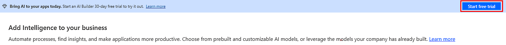
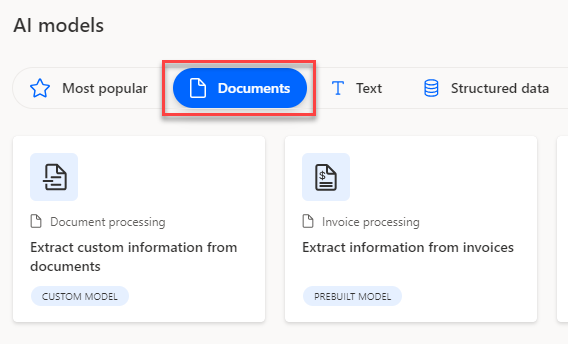
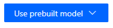

# Validate lab environment

## Exercise 1 – Setup

Task #1 - Acquire your Microsoft Power Platform trial tenant

1.  Copy your **Microsoft 365 credentials** from the Authorized Lab Hoster. 

1.  Navigate to <https://powerapps.microsoft.com> and select **Start free**.

    

1.  Under **Let's get started**, enter the email address provided by the Authorized Lab Hoster and select **Start your free trial**. 

1.  If an extra page appears with **Start building apps** and **Start using apps** buttons, then click **Start using apps** - not Start building apps.

1.  If you see a prompt that you have an existing account with Microsoft. Select **Sign in**. 

1.  Enter the password provided by the Authorized Lab Hoster and select **Sign in**. 

1.  Select **Yes** to stay signed in. 

## Exercise 2 – Environment

Task #2 – Create environment

1.  Navigate to <https://admin.powerplatform.microsoft.com> and log in with your Microsoft 365 credentials, if prompted. 

1.  If you see a Welcome pop-up, select **Get Started**. 

1.  Select **Environments** and select **+ New**.

    1. For **Name**, enter **AIBuilderEnv**

    1. For **Type**, choose **Trial** (Do not select the *Trial (subscription-based)* option).

    1. Change the toggle for **Add a Dataverse data store?** to **Yes**. 

    1. Leave all other selections as default and select **Next**. 

    1. Under the the **Security group** heading, use the **+ Select** button.

    1. Select the checkbox for the **None** item, under the **Open access** heading and then select **Done**.

    1. Leave the remaining options at their defaults and select **Save**. 

1.  Your **AIBuilder** environment should now appear in the list of Environments. 

    > Your environment may take a few minutes to provision. Refresh the page if needed. There will be a green confirmation bar at the top of the frame when the environment is ready for use.
    
## Exercise 3 – AI Builder Trial

Task #3 - Setup a trial
1. Visit the [AI Builder site](https://powerapps.microsoft.com/ai-builder/) https://powerapps.microsoft.com/ai-builder/

1. Click **Start free**

    
    
1. If you are not redirected click on the **Start free trial** button in the header

    
## Exercise 1: Working with Documnents

## Overview 

In this exercise, you will download sample data that will be used throughout the rest of the lab. From there, you will use a pre-created AI model to demonstrate how to programmatically parse an invoice in PDF Format. 

## Task 1: Download sample data

Each member of the team should complete this step.

Throughout the lab, you will need to upload various files to test out AI Builders capabilities.

- Create a folder somewhere on your computer named: **AIBuilderLabFiles**

- Download the [sample data file](https://opsgilitylabs.blob.core.windows.net/public/aibuilder/AIBuilderSampleData.zip) and unzip it's contents into the new folder.

## Task 2: Using an AI Model and Flow to Parse invoices

- Launch a new browser instance using in-private or in-cognito mode. 

- Start at the [Power Automate site](https://make.powerautomate.com/) and when prompted login with the Microsoft 365 lab account provided to your team. https://make.powerautomate.com/

- In the top right of the screen, change the Environment to **AIBuilderEnv** 

    

- With your environment selected choose **AI Models** from the navigation. If it is not visible you might have to click the **... More** navigation to add it to the menu. 

    

- In the main portion of the screen click on the **Documents** tab to filter the results. 

    
    
- Finally, select **Extract information from Invoices**

    

- In the dialog, click on **Use prebuilt model** and choose **Use in a flow** option from the dropdown. This means we will build a re-usable Power Automate Flow to create a re-usable Invoice Flow. 

    

    

- There are several connections required for this demonstration to work. If you have never used that connection before the screen will resemble the following:

    
    
- Click **Sign in** for each connection. When you click **Sign in** you will see a quick dialog and when you have **Signed in** to all three connectors it will resemble the following with **Green** circled checks:

    
    
- After that is complete you will need to click the **Continue** button

    
    
- This is using a pre-built model so there are no changes required to the **flow** presented

- Click on **Save** in the upper-right hand corner. Give it few seconds to complete. 

    \
    
- Then click on the **Test** button at the top right of your screen.

    
    
- You might also get another **Sign in** prompt. Click **Continue**

    
    

- Click the **Import** button.

- Open the **AIBuilderLabFiles** folder that has the downloaded sample data. Then open the **DocumentProcessing_Invoices_Adatum** folder and select the **Test** folder. There is only a single invoice in there and it is a pdf file called **Adatum 6.pdf** file. Select it for the import. 

- Then click the **Run flow** button at the bottom

    

- Flow is running. Then click **Done**

    

- Since there were no changes made the **final** step in the **Flow** sends an email but you should see the following steps with **green** checks next to each step:

    
    
- Click the step called **Extract information from invoices.** There are two sections available in the step. **Inputs** and **Outputs**. The **Input** section will show a binary section of text that represents the submitted pdf file. In the **Outputs** section you can see all the extracted fields in JSON format (used by developers).

    

- If you want to see the email click on the **9 square** in the upper right hand corner. Then choose **Outlook** but choose **Open in new tab**

    
    
- In **Outlook** open the item title **Invoice processed**

  
    
- Browse all the mapped fields in the email

    

    

