# Environment Setup

## Task 1 – Setup

The following instructions should be completed by a single member of your team to setup your environment. 

Task #1 - Acquire your Microsoft Power Platform trial tenant

1.  Copy your **Microsoft 365 credentials** from the credentials provided to you by your coach. 

1.  Navigate to <https://powerapps.microsoft.com> and select **Start free**.

    

1.  Under **Let's get started**, enter the email address provided by the Authorized Lab Hoster and select **Start your free trial**. 

1.  If an extra page appears with **Start building apps** and **Start using apps** buttons, then click **Start using apps** - not Start building apps.

1.  If you see a prompt that you have an existing account with Microsoft. Select **Sign in**. 

1.  Enter the password provided by the Authorized Lab Hoster and select **Sign in**. 

1.  Select **Yes** to stay signed in. 

## Task 2 – Environment

Task #2 – Create environment

1.  Navigate to <https://admin.powerplatform.microsoft.com> and log in with your Microsoft 365 credentials, if prompted. 

1.  If you see a Welcome pop-up, select **Get Started**. 

1.  Select **Environments** and select **+ New**.

    1. For **Name**, enter **[My Initials] Practice** (Example: AJ Practice).

    1. For **Type**, choose **Trial** (Do not select the *Trial (subscription-based)* option).

    1. Change the toggle for **Add a Dataverse data store?** to **Yes**. 

    1. Leave all other selections as default and select **Next**. 

    1. Under the the **Security group** heading, use the **+ Select** button.

    1. Select the checkbox for the **None** item, under the **Open access** heading and then select **Done**.

    1. Leave the remaining options at their defaults and select **Save**. 

1.  Your **Practice** environment should now appear in the list of Environments. 

    > Your environment may take a few minutes to provision. Refresh the page if needed.
    
## Task 3 – AI Builder Trial

Task #3 - Setup a trial
1. Visit the [AI Builder site](https://powerapps.microsoft.com/ai-builder/)

1. Click **Start free**

    
    
1. If you are not redirected click on the **Start free trial** button in the header

    
    
## Task 4 - Data setup

Task #4 - Manual data set up

1. Import [AIBuilderLabSolution_1_0_0_1](https://opsgilitylabs.blob.core.windows.net/public/aibuilder/AIBuilderLabSolution_1_0_0_2.zip) solution to the Dataverse environment

    This will create five (5) Dataverse tables - **Object Detection Product**, **Health Feedback**, **Online Shopping Intent**, **Travel Feedback**, and **Expenses**.

1. Step 2: Upload data to the entities created in step 1

- **Prediction**: Follow the instructions in to upload the **Online Shopping Intent** data.
     - Download the  AIBPredictionSample_simpledeploy_v4.21.3.zip
     - Ensure that the file isn't blocked after you download. To do this:  
    In the Downloads folder, find the downloaded zip file, right-click, and then select Properties.
    
    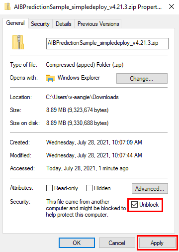
    
    On the General tab, select the Unblock checkbox, and then select Apply.
    - Extract the .zip file, and look for PackageDeployer.exe in the extracted folder.
    
    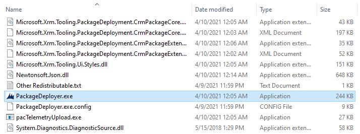
    - Run PackageDeployer.exe. The following screen will appear.
    
    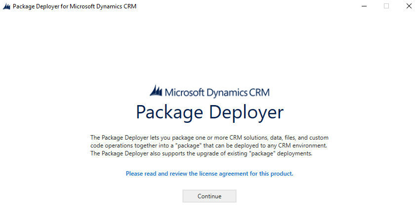
    
    - Select Continue.

    - Select Office 365, and then select Login.
    
      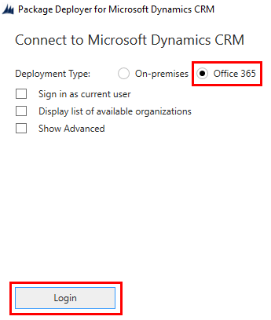
    - Enter the credentials that you use to sign in to the Power Apps maker portal, and then select Next.
    
    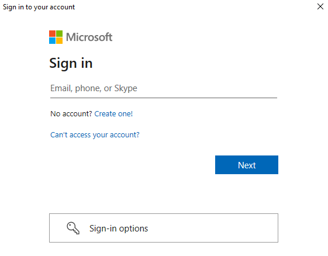
    
    - If the sign-in is successful, you'll see the Welcome screen. Read the message, and then select Next.
    
    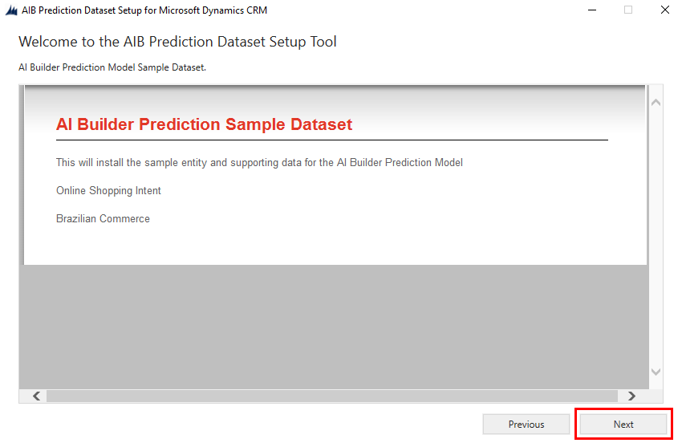
    
    - On the Ready to Install screen, make sure you're installing the solution in the correct environment and then select Next.
    
    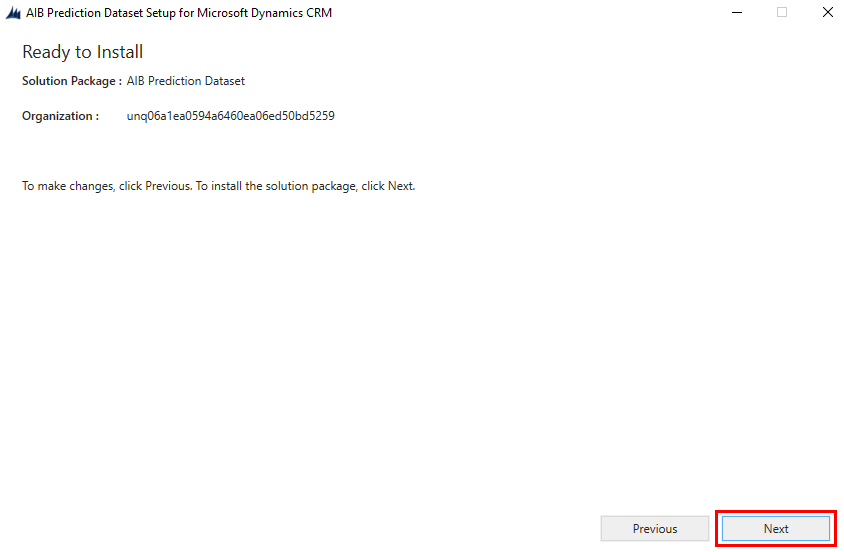
    
    - On the Reading AIB Prediction Dataset Installer Configuration screen, read the summary information for the data and solutions being imported and then select Next.

    It will take a few minutes to import the data. As each step is completed successfully, you'll see a green circle with a check mark next to the step.
    
    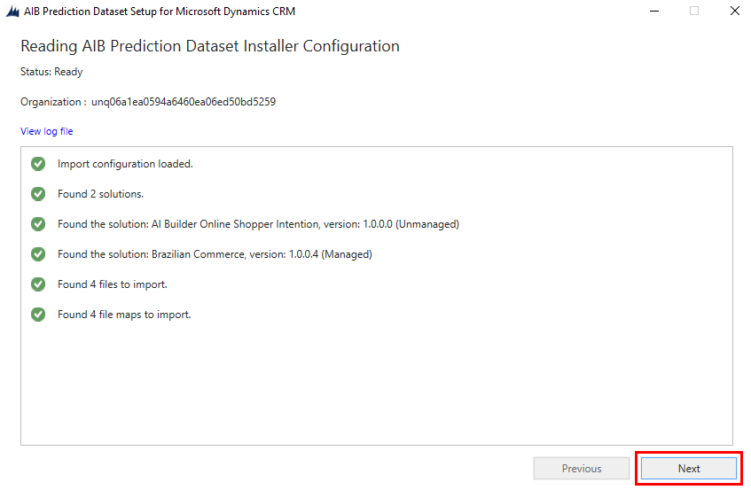
    
    - On the Installation Complete screen, select Finish.
    
    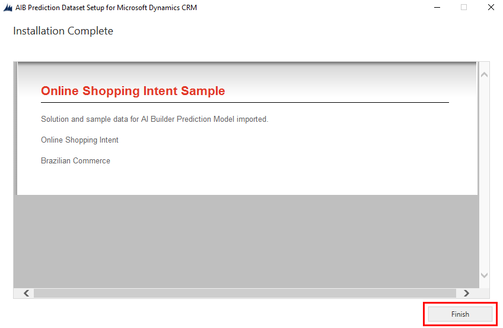
    
- **Category classification**: Go to the **Lab Data/CategoryClassification** folder within the lab files, and then upload the data from **[aib_categoryclassification](https://opsgilitylabs.blob.core.windows.net/public/aibuilder/aib_categoryclassification.xlsx)**. Follow the instructions below:

    - Select the appropriate environment you want to work in.
    - Select Data > Tables.
    - Select Data > Get data > Get data from Excel from the ribbon of the selected table.
    
    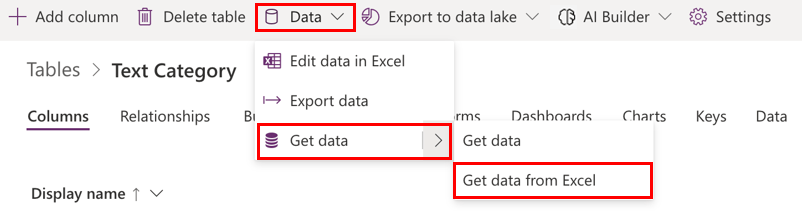
    
    - On the Import data screen, select the [Excel file](https://opsgilitylabs.blob.core.windows.net/public/aibuilder/aib_categoryclassification.xlsx) and then select Upload.
    
    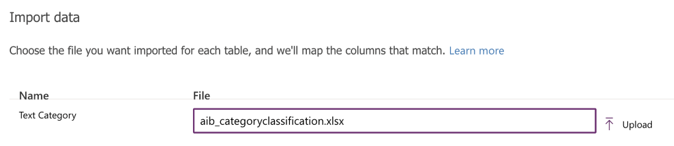
    
    - To review the field mappings on the Column mappings for Text Category screen, select Map Columns.
    
    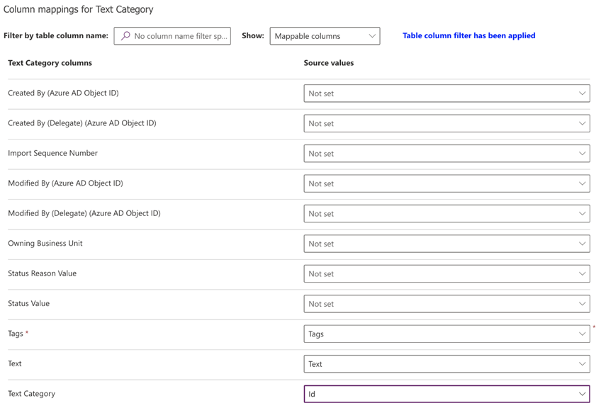
        
    The left side lists all columns defined in the table. The dropdown list on the right shows the columns available in the Excel file.

    Map the Tags, Text, and Id columns from Excel to the respective columns in the table.

    - After you've mapped the columns, go back to the import step by selecting Save changes in the upper-right corner.
    
    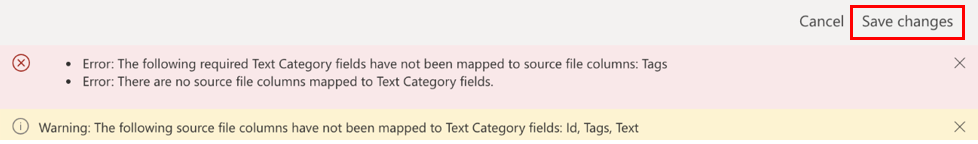
    
    - After you see the Mapping status as successful, begin the import process by selecting Import in the upper-right corner.
    
    
    
    - The import process might take a few minutes depending on the volume of data being imported. After a few minutes, refresh the Data tab of the table to find all the records imported from the Excel file.
    
- **Entity extraction**: Go to the **Lab Data/EntityExtraction** folder with the lab files, and then upload the data from **aib_travelfeedback**. 
    - Select Solutions > AIBuilderLabs > Tables > Travel Feedback.
    
    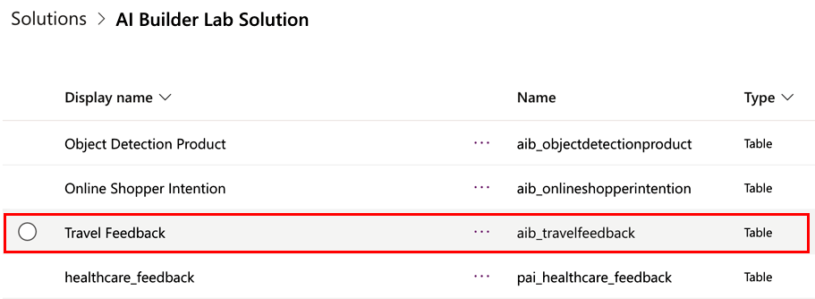
    
    - Select Data > Get data > Get data from Excel from the ribbon.
    
    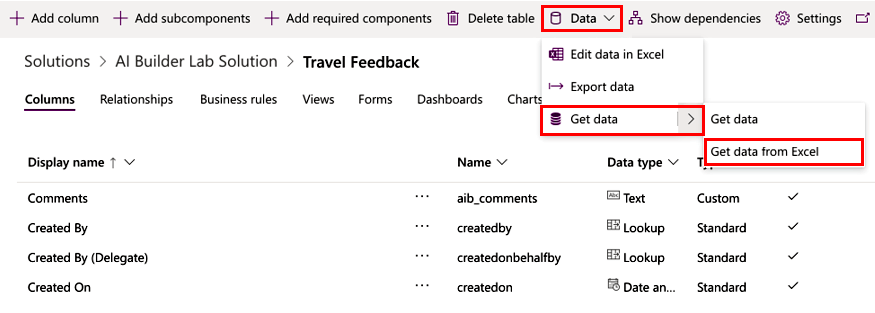
    
    - You'll see the Import data screen:
    
    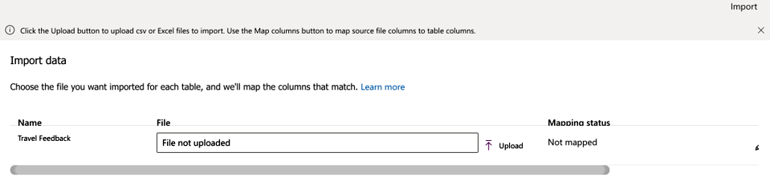
    
    - Select [aib_travelfeedback.csv](https://opsgilitylabs.blob.core.windows.net/public/aibuilder/EntityClassification/aib_travelfeedback.csv), which has the data to be imported in this table.
    
    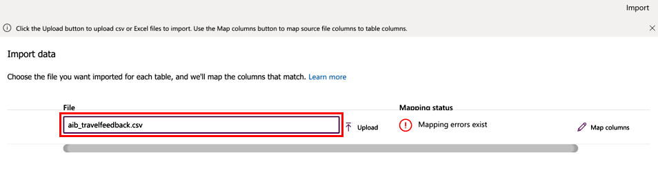
    
    - Review the column mappings by selecting Map columns.

    - Map the Name and Comments columns in the Source values column, and select Save changes.
    
    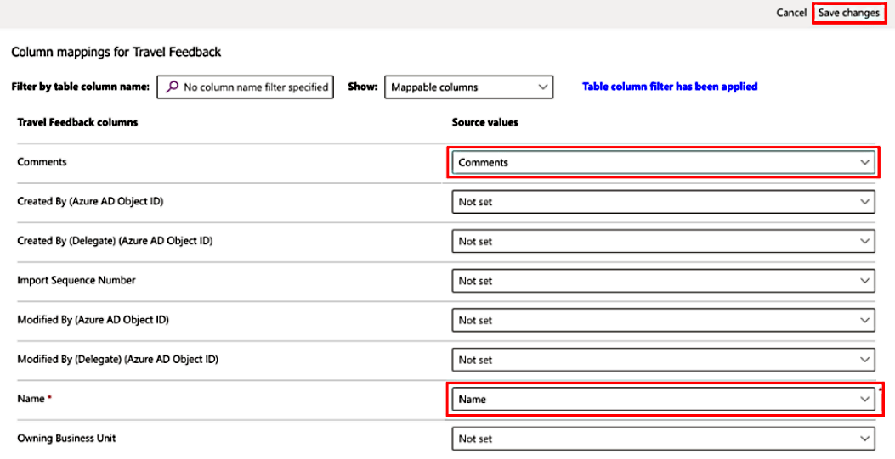
    
    You'll return to the Import data screen with status updated to reflect that the mappings are complete.
    
    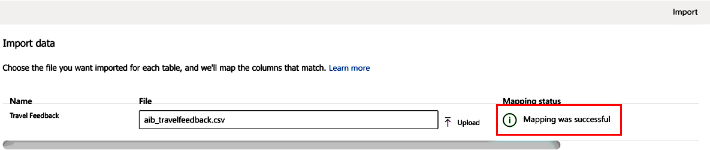
    
    - Select **Import** on the top right for the import process to begin.

    It might take a few minutes for the import process to complete, depending on the rows included in the file provided.

    - Select the Data tab for the Travel Feedback table in the solution to view all the records imported
    
    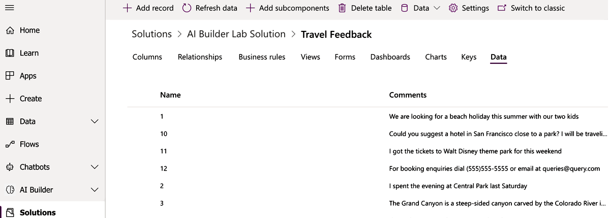

    > **Note**: For business card reader, document processing, identity document reader, object detection, receipt processing, and text recognition labs, you'll need images/pdfs that are available in the **[LabImages](https://opsgilitylabs.blob.core.windows.net/public/aibuilder/LabImages.zip)** downloaded folder.

# Lab 1: Working with Documents

## Invoice processing prebuilt AI model

The invoice processing prebuilt AI model extracts key invoice data to help automate the processing of invoices. The invoice processing model is optimized to recognize common invoice elements like invoice ID, invoice date, amount due, and more.

## Supported languages and files

The following languages are supported: Dutch (Netherlands), English (Australia), English (Canada), English (India), English (United Kingdom), English (United States), French (France), German (Germany), Italian (Italy), Portuguese (Portugal), Spanish (Spain).

To get the best results, provide one clear photo or scan per invoice.

- The image format must be JPEG, PNG, or PDF.
- The file size must not exceed 20 MB.
- The image dimensions must be between 50 x 50 pixels and 10,000 x 10,000 pixels.
- PDF dimensions must be at most 17 x 17 inches, which is the equivalent of the Legal or A3 paper sizes or smaller.
- For PDF documents, only the first 2,000 pages are processed.

## Key-value pairs

Key-value pairs are all the identified labels or keys and their associated responses or values. You can use these to extract additional values that aren't part of the predefined list of fields.

To visualize all key-value pairs detected by the invoice processing model, you can add a **Create HTML table** action in your flow as shown in the screenshot and run the flow.

To extract a specific key for which you know its value, you can use the **Filter array** action as shown on the screenshot below. In the example of the screenshot, we want to extract the value for the key **Tel .:**

## Exercise 1
- Start at the [AI Builder site](https://powerapps.microsoft.com/ai-builder/)

- With your environment selected choose **AI Models** from the navigation. If it is not visible you might have to click the **... More** navigation to add it to the menu. 

    
    
- In the main portion of the screen click on the **Documents** tab to filter the results. Finally, select **Extract information from Invoices**

    
    
**Note:** Ensure that you are not in the **custom information** extraction

- In the dialog, click on **Use prebuilt model** and choose **Use in a flow** option from the dropdown. This means we will build a re-usable Power Automate Flow to create a re-usable Invoice Flow. 

    

- There are several connections required for this demonstration to work. If you have never used that connection before the screen will resemble the following:

    
    
- When you click **Sign in** you will see a quick dialog and when you have **Signed in** to all three connectors it will resemble the following with **Green** circled checks:

    
    
- After that is complete you will need to click the **Continue** button

    
    
- This is using a pre-built model so there are no changes required to the **flow** presented

- Click on **Save** in the upper-right hand corner. Give it few seconds to complete. 

    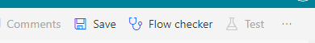\
    
- Then click on the **Test** button

    
    
- You might also get another **Sign in** prompt. Click **Continue**

    
    
- Click the **Import** button and open the folder you extracted the **aibuilderlab** content into. Then open the **Lab Images** folder. Then open the **DocumentProcessing_Invoices_Adatum** folder and select the **Test** folder. There is only a single invoice in there and it is a pdf file called **Adatum 6.pdf** file. 

- Then click the **Run flow** button at the bottom

    

- Flow is running. Then click **Done**

    

- Since there were no changes made the **final** step in the **Flow** sends an email but you should see the following steps with **green** checks next to each step:

    
    
- Expand the step called**Extract information from invoices.** There are two sections available in the step. **Inputs** and **Outputs**. The **Input** section will show a binary section of text that represents the submitted pdf file. In the **Outputs** section you can see all the extracted fields. 

    
    
- If you want to see the email click on the **9 square** in the upper right hand corner. Then choose **Outlook** but choose **Open in new tab**

    
    
- In **Outlook** open the item title **Invoice processed**

    
    
- Browse all the mapped fields in the email

    

    

