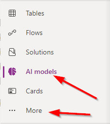
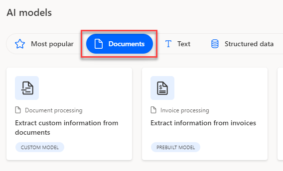
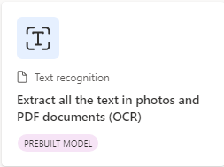
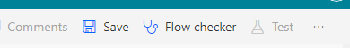
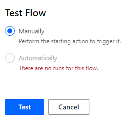
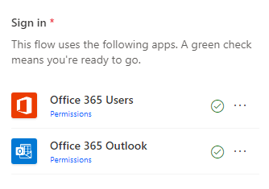
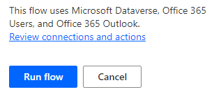
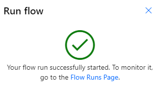
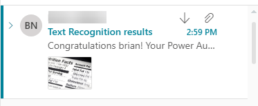

## Exercise 2

- Using the same in-private browser instance, navigate to the [Power Automate site](https://make.powerautomate.com/) if you are not already there. 

- In the top right of the screen, ensure the Environment is set to **AIBuilderEnv**.

- Choose **AI Models** from the navigation. If it is not visible you might have to click the **... More** navigation to add it to the menu. 

    

- In the main portion of the screen click on the **Documents** tab to filter the results. 

    

- In the main portion of the screen click on the **Documents** tab to filter the results. Finally, select **Extract all the text in photos and PDF Documents(OCR)**

    
    
- In the dialog, click on **Use prebuilt model** and choose **Use in a flow** option from the dropdown. This means we will build a re-usable Power Automate Flow to create a re-usable Flow to Extract all the text in photos and PDF documents (OCR). 

- Very similiar to the previous exercise validate that you see green checks next to all the connections. Then click **Continue**

- Click on **Save** in the upper-right hand corner. Give it few seconds to complete. 

    \
    
- Then click on the **Test** button

    
    
- You might also get another **Sign in** prompt. Click **Continue**

    

- Click the **Import** button.

- Open the **AIBuilderLabFiles** folder that has the downloaded sample data. Then open the **TextRecognizer** folder. Select the **TextReco-SamplePrinted.png** invoice for the import. 

- Then click the **Run flow** button at the bottom

    

- Flow is running. Then click **Done**

    
    
- Next visit the Outlook web email again and look for the **Text Recognition results** email.

    
    
- Review the results

    

## Summary

In this exercise, you created a flow that leveraged a pre-created AI Builder model to parse the text out of an image and emailed the results all without writing any code.
