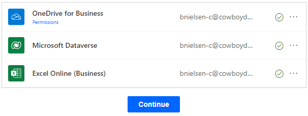
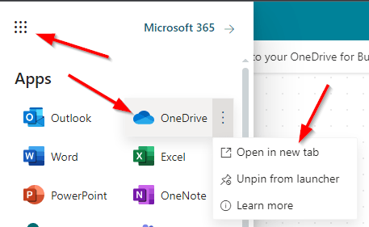
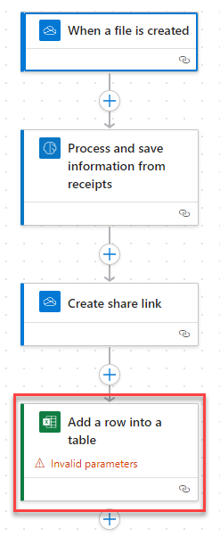
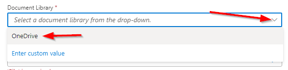
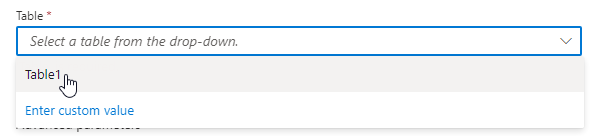
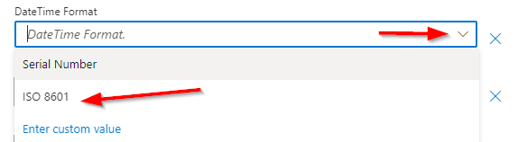
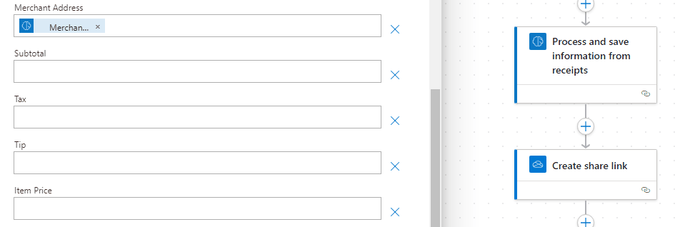

## Exercise 3 - Extract information from receipts

- Using the same in-private browser instance, navigate to the [Power Apps site](https://make.powerapps.com/) site.  

- In the top right of the screen, ensure the Environment is set to **AIBuilderEnv**.

- With your environment selected choose **AI Models** from the navigation. If it is not visible you might have to click the **... More** navigation to add it to the menu. 

    

- In the main portion of the screen click on the **Documents** tab to filter the results. 

- Finally, select **Extract information from receipts**

    
    
- In the dialog, click on **Use prebuilt model** and choose **Use in a flow** option from the dropdown. This means we will build a re-usable Power Automate Flow to create a re-usable Flow to Extract all the text in photos and PDF documents (OCR). 

- Select the **Track expenses by scanning receipts to your OneDrive for Business** template that is already pre-created.

    

- Very similiar to the previous exercise validate that you see green checks next to all the connections. Then click **Continue**

    
    
- Before configuring the **Flow** click on the nine square in the upper-right hand corner. Then select the three dots next to **OneDrive** and choose **Open in new tab**

    
    
- In OneDrive click on the **Add new** button and choose **Files upload**

- Upload the following file **Receipts.xlsx** from the Lab Downloads file in the **AIBuilderLabFiles\ReceiptsProcessing_Contoso** folder.

- Return to the **Flow** tab in the browser

- There are two steps that need additional configuration. Select the first step called **When a file is created**. When selected the properties panel will open. Click on the **folder** icon and choose **Root** to select the top level folder in **OneDrive**.

    
    
- Now select the fourth, and last step, called **Add a row into a table**. **Note:** this does require the file to uploaded from the previous step. 

    

   
- In the properties panel choose the **Document Library** and select **OneDrive**

    
    
- Next click on the folder icon and select the **Receipts.xlsx** file previously uploaded.

- In the **Table** dropdown select **Table1** which is defined in the Excel spreadsheet that was uploaded to OneDrive.

    

- The view after configured.

    

    
- In the **Advanced parameters** section you should see some pre-populated values. Click on the **Show all** link. This will show all the potential values available.

    
    
- From the **DateTime Format** dropdown choose **ISO 8601**

    

- To add additional parameters you can use the following animation to assist.

    
    

- Click on **Save** in the upper right-hand corner

    
    
- Remove the following unnesserry options by clicking the X button. Then click **Save** again.

    

  
- Then click on **Test** and choose the radio button for **Manually** and finally click the **Test** button. This will start the flow to monitor for uploaded files to OneDrive.

    
    

- Switch back to the OneDrive tab and upload one of the sample receipts from the C:\LabFiles\ReceiptsProcessing_Contoso folder. 

- This shows the completed **Flow**

    
    
- Now switch back to the **OneDrive** tab and open the **Receipts.xlsx** file

- Depending on the parameters added and file chosen you might see different values

    

    > The values were parsed from the uploaded reciept and stored in the spreadsheet.

    

## Summary

In this exercise, you created a flow that leveraged a pre-created AI Builder model to parse data out of uploaded reciepts and saved the results in a spreadsheet all without writing any code.