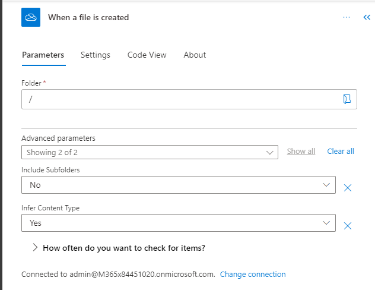

## Exercise 4 - Detect positive, negative, or neutral sentiment

- In this exercise rather than use a pre-built model. We will be creating our own model.

- Starting at the nine-square in the upper left-hand corner mouseover **Power Automate** and select the three dots and choose **Open in new tab**

    
    

- With your environment selected choose **Create** from the navigation. 

    
    
- Then choose **Automated cloud flow**

    
    
- In the following prompt select **When a file is created** for the **OneDrive for Business** trigger. Then click **Create**.

    

- There should be one **Trigger** on the page that needs to be configured.

- Select the **Trigger** and select **Root**

    
    
- Next click on the **+** sign and choose **Add an action**

    
    
- In the slideout search for **sentiment** and choose **Analyze positive or negative sentiment in text**. This will add another step to the flow.

    

- The properties side panel will open. In the **Language** section click on the dropdown and choose **English**

    
    
- In the **Text** field we need to pass in the value provided from **OneDrive**. Specifically the content. Click inside the text field and it will be highlighted with a blue bounding box. Then click on the blue lightning bolt.

    
    
- In the popup search for **content** in the text box and then choose **File content**

    
    
- Next click on the **+** sign and choose **Add an action**

    
    
- Search for **condition** and select **Condition** from the options provided

    
    
- The resulting condition

    
    
- Let's set the **Condition** parameters. Click in the **Choose a value** field and you will notice the blue box. Click on the lightning bolt. Then scroll down and select **Overall text sentiment**. In the second text box put in the word **positive**.

    
    
- In the **True** path add another **Action**

    
    
- Search for **notification** and choose **Send me an email notification**

    
    
- Click in the **Subject** text box and click on the lightning bolt

    
    
- Select **Overall text sentiment**

    
    
- Do exactly the same steps for the **Body** content

- Then repeat the same steps on the **False** path.

- Click on **Save** and wait a few moments until you get a confirmation that the flow has been saved

    
    
- Then click on **Test** and choose the radio button for **Manually** and finally click the **Test** button. Similar to the previous exercise you need to kickoff the test, switch the **OneDrive** and upload one of the files in [this zip file](https://opsgilitylabs.blob.core.windows.net/public/aibuilder/reviews.zip). 

    

- After the flow completes it should resemble the following

    
    
- You can also visit the **Outlook** web client to see the notification and text that was sent.

    