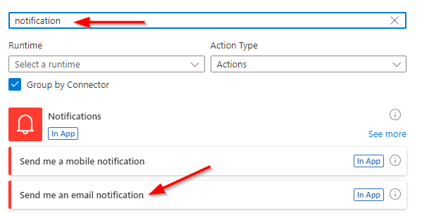
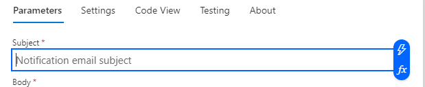

# ChatGPT and Flow

## Exercise 5 - Classify text

- Start at [Power Automate](https://make.powerautomate.com/)

- With your environment selected choose **+ Create** from the navigation on the left. 

- Next click on the **Automated cloud flow** button.

    
    
- In the following dialog select **When a file is created** for **OneDrive for Business** then click **Create**

    

- Click the **When a file is created** action.

    

    
- Similar to the previous exercises we need to configure this trigger step. So select the step and choose a folder to use (eg. Root)

    
    
- Next click on the plus sign and select **Add an action**

    
    
- Search for **prompt** and click on the **See more** link under **AI Builder**

    

    
- Choose **Classify text into categories with the standard model**

    
    
- Select **English** from the first dropdown for the selected step. Then select the **Text** box below and select the lightning bolt to choose **File content**

- Next click on the plus sign and select **Add an action**

        
    
- Search for **notification** and then select **Send me an email notification**

    

- Click in the **Subject** text box and click on the lightning bolt

    
    
- For both **Subject** and **Body** select **Classification** from the options

    
    
- Click on **Save** and wait a few moments until you get a confirmation that the flow has been saved

    
    
- Then click on **Test** and choose the radio button for **Manually** and finally click the **Test** button. Similar to the previous exercise you need to kickoff the test, switch the **OneDrive** and upload one of the files in the **AIBuilderLabFiles\Reviews** folder.

- Now upload one of the review documents to **OneDrive for Business**

- Review the emails sent in Outlook Web Access to see their classification. 

>**Note**: *Sometimes more than one notification will come across.*