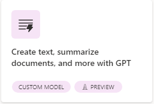
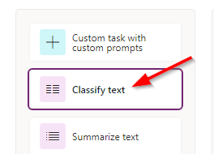
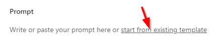
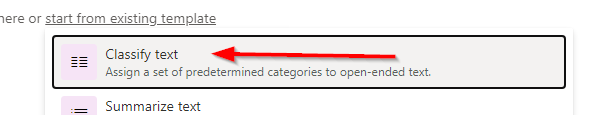
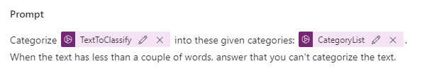
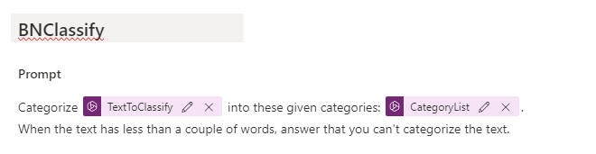
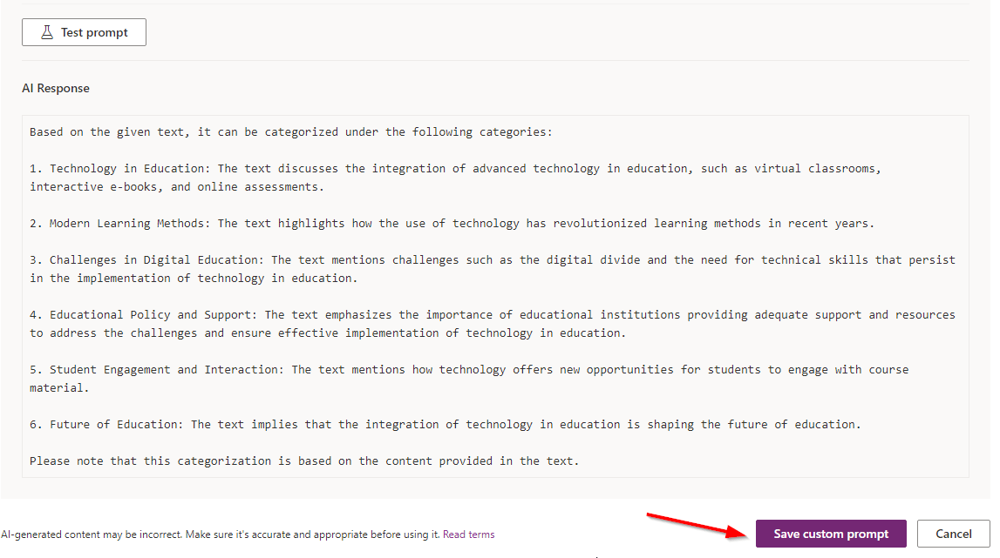

## Exercise 6 - Classify text custom

> In this section you will be using a similar classification but rather than the pre-existing model we will create a custom model to utilize.

- Start at [Power Automate](https://make.powerautomate.com/)

- With your environment selected choose **AI Models** from the navigation. If it is not visible you might have to click the **... More** navigation to add it to the menu. 

    
    
- Under the **Most Popular** tab select **Prompts now have their own section**

- This will redirect and then choose **Create text, summarize documents, and more with GPT**.

    
    
- On the left hand side choose **Classify text** from the options available

    
    
- Click on the **Create custom prompt**

    
    
- Then click on the link text that says **start from existing template**

    
    
- For the first example choose **Classify text**

    
    
- The result will resemble the following:

    
    
- Click on the text that starts with **Custom prompt** and includes a Date/Time value. Update the text to be your initials+Classify (eg. BNClassify)

    
    
- Click on **Test your prompt** and copy the following text into the **TextToClassify**:

> In recent years, the integration of advanced technology in education has revolutionized learning methods. Virtual classrooms, interactive e-books, and online assessments have become increasingly popular, offering new opportunities for students to engage with course material. Despite these advancements, challenges such as digital divide and the need for technical skills persist, making it imperative for educational institutions to provide adequate support and resources.

- Copy the following into the **CategoryList** and then click **Test prompt**:

> Technology in Education, Modern Learning Methods, Challenges in Digital Education, Educational Policy and Support, Student Engagement and Interaction, Future of Education

- Results from click **Test Prompt**. Click **Save prompt** 

    