## Exercise 7 - Summarize text custom

- Start at the [AI Builder site](https://powerapps.microsoft.com/ai-builder/)

- With your environment selected choose **AI Models** from the navigation. If it is not visible you might have to click the **... More** navigation to add it to the menu. 

    
    
- Under the **Most Popular** tab select **Prompts now have their own section**

- This will redirect and then choose **Create text, summarize documents, and more with GPT**.

    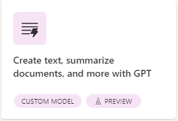
    
- On the left hand side choose **Summarize text** from the options available

    

- Click on the **Create custom prompt**

    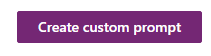
    
- Then click on the link text that says **start from existing template**

    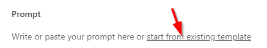

- Select **Summarize text** from the available options

    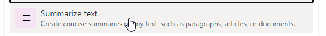

- Use [this link](https://www.prnewswire.com/news-releases/giant-food-donates-11-000-turkeys-to-support-local-feeding-america-food-banks-and-nonprofits-this-holiday-season-301992824.html) to summarize a press release. And copy and paste the content in the **Test your prompt** section for **TextToSummarize**. Click on **Test prompt** and finally click **Save custom prompt**

    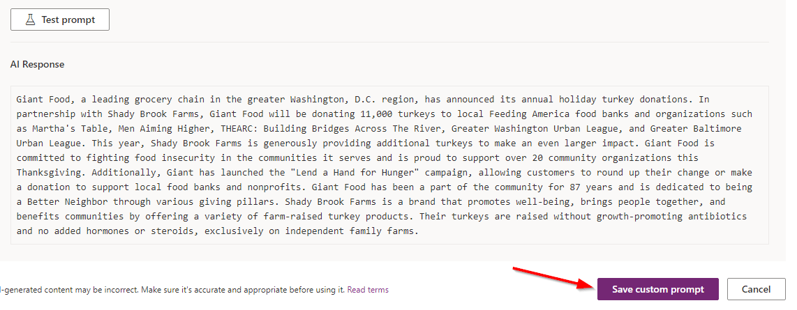
    
- Click on the text that starts with **Custom prompt** and includes a Date/Time value. Update the text to be your initials+Summarize (eg. BNSummarize)
    
> Let's use our new custom prompt in a flow

- Start at https://make.powerautomate.com/ and make sure your environment is selected

- Select the **+ Create** link in the left hand navigation

    

- Click on **Automated cloud flow**

    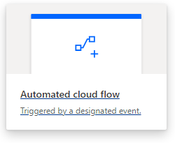
    
- In the following dialog select **When a file is created** for **OneDrive for Business** then click **Create**

    
    
- Similar to the previous exercises we need to configure this trigger step. So select the step and choose a folder to use (eg. Root)

    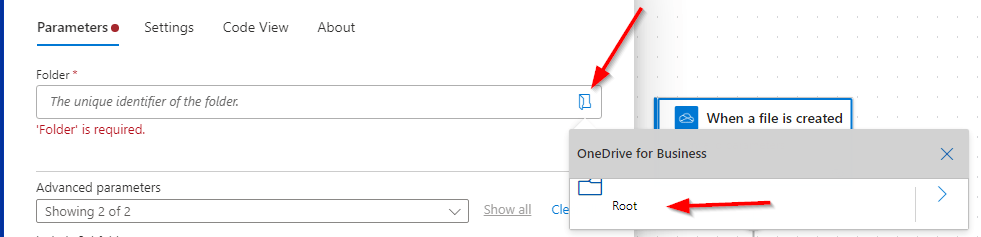
    
- Next click on the plus sign and select **Add an action**

    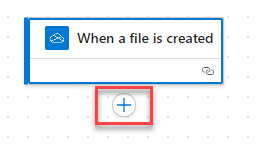
    
- Search for **gpt** and then select on **Create text with GPT (V2)**

    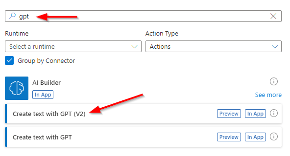
    
- From the dropdown choose your custom summarize prompt that starts with your initials

    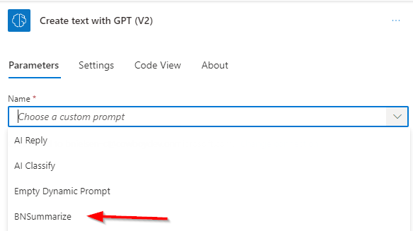
    
- After a moment you will get an additional textbox. Click inside of it. Click the lightning bolt and choose **File content**

    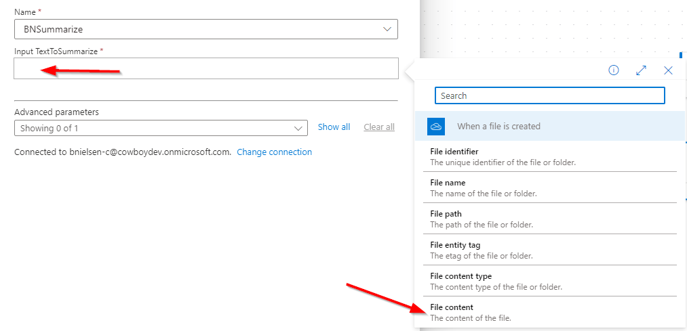
    
- Next click on the plus sign and select **Add an action**

        
    
- Search for **approval** and select **Start and wait for an approval**

    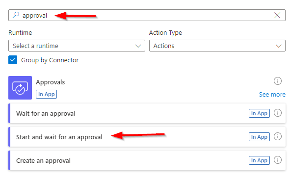
    
- From the properties panel for the **Approval type** dropdown select the first option **Approve/Reject - First to respond**

> Note: This is a required step for any OpenAI generated content. No OpenAI content should be published with out approving first.

- After selecting that option there are more fields available

    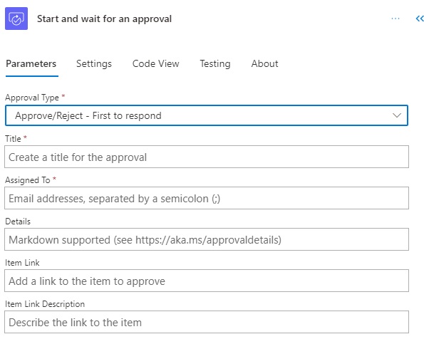
    
- Use the following to fill it in

    - **Title**: Approval
    - **Assigned To**: (use email address you are logged in with)
    - **Details**: Select the lightning bolt and choose **Text**
    - **Item link**: (leave blank)
    - **Item link Description**: (leave blank)
    
    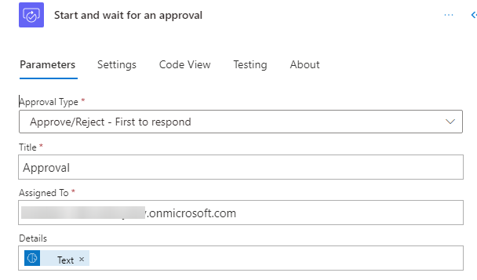
    
- Next click on the plus sign and select **Add an action**

        
    
- Search for **notification** and then select **Send me an email notification**

    

- Click in the **Subject** text box and type in **Summary**

    
    
- For **Body** select **Test** from the options

    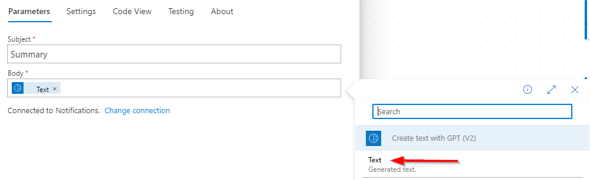
    
- Click on **Save** and wait a few moments until you get a confirmation that the flow has been saved

    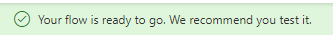
    
- Then click on **Test** and choose the radio button for **Manually** and finally click the **Test** button. Similar to the previous exercise you need to kickoff the test, switch the **OneDrive** and upload one of the files in [this zip file](https://opsgilitylabs.blob.core.windows.net/public/aibuilder/reviews.zip). 

- Now upload one of the review documents to **OneDrive for Business**

> Note: With this test we need to approve the generated text

- Visit **Outlook Web Access**. You might get other notifications from other flows created. Look for the **Approval** email. The content will be a summary of the provided review. Similar to the following for **review3.txt**

    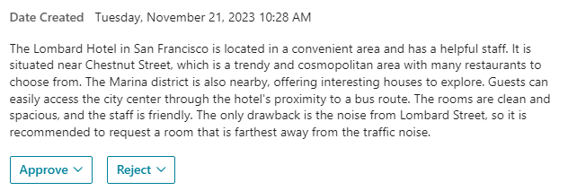
    
- Click on **Approve** and a comment box appears. Click the **Submit** button

    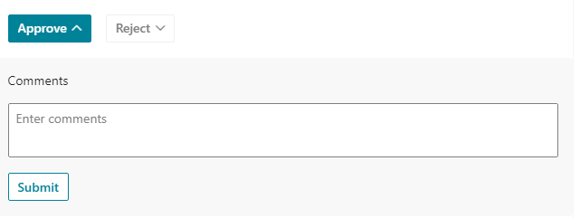
    
- Stay in **Outlook Web Access** and await the notification with the Subject title of **Summary**

    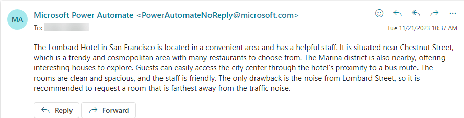