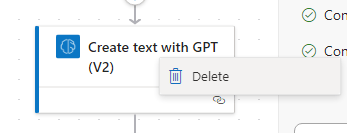

## Exercise 8 - Generate custom 
> In this exercise you will be using the previously built Flow and swap out the previous OpenAI step for another one.

- The current Flow looks like the following. Click on **Edit** in the upper right hand corner:

    
    
- Below the **When a file is created** step click on the plus sign and select **Add an action**

    

- Search for **gpt** and click on **See more**

    
    
- Select **Create text with GPT** and then click the **Create prompt** button

    
    
- Another pane will open on the left side. Select **Create blog posts**

    
    
- Preview the text model and then click **Use prompt in flow**

    
    
- The text between **[Start of topic]** and **[End of topic]** needs to be swapped out for the content we will upload to **OneDrive**. So highlight that text and then click the lightning bolt

    
    
- It should be replaced with the same **Text** option we have been using previously. The end result will look like the following:

    

- Right click on the previously  used **Create text with GPT (V2)** and choose **Delete**. Then click **OK** when prompted.

    

- Select the **Start and wait for an approval**. The **Details** value needs to be replaced with the new step. Click on the **x** to remove

    
    
- Select the **Text** value from the new **Create text with GPT** step in the **Approval** and also in the **email notification** step.

- Then go ahead and **Save** and **Test**. If you see a GPT error. Delete and replace the **Create text with GPT** with the identical step.

- In the Outlook Web Access you should receive an Approval email. The content should have a fairly long blog post.

    
    
- Click on **Approve** and then click **Submit** to get the final result mailed to you

    